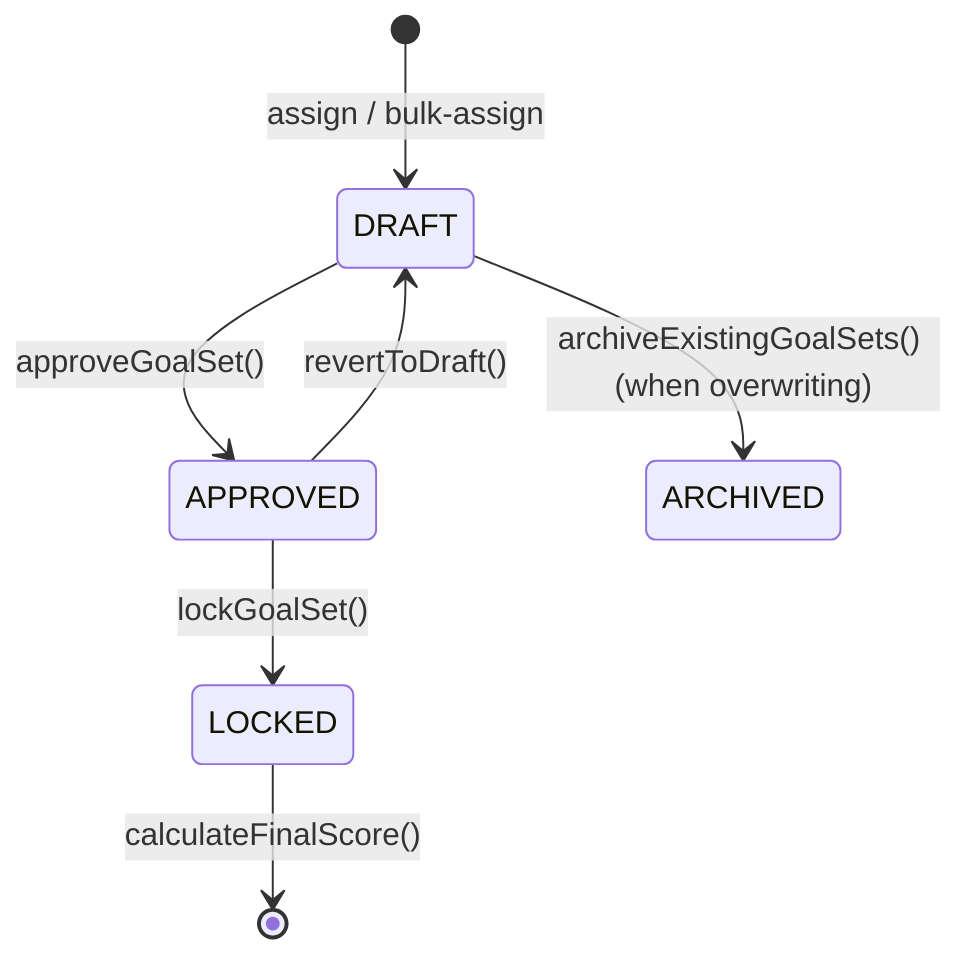
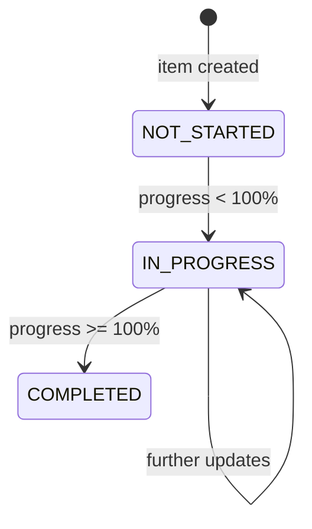

# KPI Module — Complete Flow Analysis

## Overview

The KPI module is a **multi-layered, role-driven performance management system** built with Spring Boot (backend) and React/RTK Query (frontend). It follows a **top-down assignment workflow**: HR/Admin creates library templates → Manager assigns to employees → Employee tracks progress → Manager approves/locks → System finalizes score.

---

## 1. Data Model Hierarchy

```
KpiLibrary  ──(1:N)──▶  KpiLibraryDetails   (template layer)
     │
     └── linked to Position
     
KpiGoals    ──(1:N)──▶  KpiGoalItem          (live goal layer)
     │                       └── KpiProgress  (progress snapshots)
     ├── linked to Employee (owner)
     ├── linked to Employee (manager)
     └── linked to AppraisalCycle

KpiFinalScore ──▶ KpiGoals + Employee + Appraisal  (finalization)

KpiHistoryLog   (full audit trail for every state change)
KpiCategory     (categorizes each goal item)
```

| Entity | Table | Purpose |
|---|---|---|
| `KpiLibrary` | `kpi_library` | Reusable KPI template tied to a Position |
| `KpiLibraryDetails` | (child) | Individual goal lines in a template |
| `KpiGoals` | `kpi_goals` | Employee's live goal-set for a cycle |
| `KpiGoalItem` | `kpi_goal_items` | Concrete goal items with scoring math |
| `KpiProgress` | — | Immutable progress snapshots per update |
| `KpiFinalScore` | `kpi_final_scores` | Locked final weighted score per cycle |
| `KpiHistoryLog` | — | Append-only audit log of all KPI events |
| `KpiCategory` | — | Category classification for goal items |

---

## 2. KpiGoalStatus State Machine



> [!IMPORTANT]
> ARCHIVED and LOCKED are terminal states. A LOCKED goal set cannot be reverted. A finalized score cannot be recalculated.

---

## 3. KpiItemStatus State Machine



---

## 4. Full End-to-End Workflow

### Phase 1 — Library Setup (HR/Admin only)

```
POST /api/v1/kpi/library
POST /api/v1/kpi/library/import      ← Excel .xlsx upload
PUT  /api/v1/kpi/library/{id}
POST /api/v1/kpi/library/{id}/clone
PATCH /api/v1/kpi/library/{id}/status         ← activate/deactivate
PATCH /api/v1/kpi/library/{id}/toggle-history-status
DELETE /api/v1/kpi/library/{id}
```

**`createLibrary` validation rules:**
- At least 1 detail required
- No duplicate goal titles within the same library
- Each item weight ≤ **35%**
- Total weight must be exactly **100%**

**`importLibraries` (Excel):**
- Only `.xlsx` accepted
- Uses `StyledKpiExcelParser` to parse sheets
- **Soft-replace logic**: if a library with the same title + positionId already exists and is active → deactivate it first, then create a new active one
- Returns `KpiImportResult` with success/failed counts and error list

**`toggleHistoryStatus`** (exclusive activation):
- When activating a library, automatically **deactivates all other libraries** for the same position → ensures only 1 active library per position at a time

---

### Phase 2 — Goal Assignment (Manager/HR/Admin)

```
POST /api/v1/kpi/assign           ← single employee
POST /api/v1/kpi/bulk-assign      ← multiple employees at once
```

**Single Assignment flow (`assignKpiToEmployee`):**
1. Validate employee exists
2. Validate library is **active** (if provided)
3. Validate appraisal cycle exists
4. Check existing goals for that employee + cycle:
   - If `APPROVED` or `LOCKED` → **hard block**, cannot overwrite
   - If `DRAFT` + `overwriteExisting=true` → archive old, create new
   - If `DRAFT` + `overwriteExisting=false` → throw conflict error
5. Create `KpiGoals` with status `DRAFT`, version `1`
6. Copy `KpiLibraryDetails` → `KpiGoalItem[]` (actualValue=0, scorePercent=0, weightedScore=0, status=NOT_STARTED)
7. Publish `KPI_ASSIGNED` notification to employee
8. Write `KPI_ASSIGNED` to `KpiHistoryLog`
9. Write to Audit log

**Bulk Assignment:**
- Same logic per employee, but APPROVED/LOCKED → **SKIPPED** (not blocked)
- Each employee result is tracked individually in `BulkAssignmentResponse`

---

### Phase 3 — Goal Item Management (Manager/HR/Admin — DRAFT only)

```
POST   /api/v1/kpi/goal-set/{goalSetId}/items    ← add item
PUT    /api/v1/kpi/items/{itemId}                ← update item
DELETE /api/v1/kpi/items/{itemId}                ← delete item
PUT    /api/v1/kpi/goal-set/{id}/bulk-items      ← bulk update
```

**Rules:**
- Goal set must be in **DRAFT** status
- Item weight cap: ≤ **35%**
- Delete blocked if item has existing `KpiProgress` records → use Revise flow instead

---

### Phase 4 — Goal Approval (Manager/HR/Admin)

```
POST /api/v1/kpi/approve/{id}
```

**`approveGoalSet` flow:**
1. Verify caller is the **creator manager**, **direct reporting-line manager**, or **HR/Admin**
2. Goal set must be in `DRAFT`
3. Sum of **active** item weights must equal **exactly 100%**
4. Set status → `APPROVED`, record `approvedAt` + `approvedBy`
5. Notify employee: `KPI_APPROVED`
6. Log `KPI_APPROVED` to history
7. Write audit log

**Revert to Draft:**
```
POST /api/v1/kpi/goal-set/{id}/revert
```
- Allowed from `APPROVED` (not from `LOCKED` or `ARCHIVED`)
- Sends `KPI_REJECTED` type notification to employee

---

### Phase 5 — KPI Revision (Manager/HR/Admin — DRAFT or APPROVED)

```
PUT /api/v1/kpi/revise/{itemId}
```

**`reviseKpi` flow:**
1. Auth: only creator manager, direct manager, or HR/Admin
2. Allowed on `DRAFT` or `APPROVED` goal sets
3. Detects field-level changes (title, targetValue, weightPercent, category) and builds diff string
4. If no actual changes detected → throw error (no no-op revisions)
5. Updates item **in-place** (progress history stays intact)
6. Bumps `KpiGoals.version` by +1
7. Sends `KPI_REVISED` notification with change reason
8. Logs `ITEM_REVISED` to history with old→new diff

---

### Phase 6 — Progress Tracking (Employee / Manager for compliance items)

```
POST /api/v1/kpi/progress
GET  /api/v1/kpi/progress/history?employeeId=&limit=
```

**`updateProgress` flow:**
1. Goal set must be `APPROVED` (not DRAFT, not LOCKED)
2. Auth:
   - Employee → can update **their own** items
   - Manager/HR/Admin → can update **compliance items only** (for verification)
3. Validate `actualValue`:
   - Must be ≥ 0
   - Must be ≤ `targetValue`
4. Save immutable `KpiProgress` snapshot
5. Recalculate on `KpiGoalItem`:
   - `scorePercent = (actualValue / targetValue) × 100`
   - Special case: if `targetValue == 0` → 100% if actual is 0, else 0% (Zero Tolerance)
   - `weightedScore = scorePercent × (weightPercent / 100)`
6. Update item status: `IN_PROGRESS` or `COMPLETED`
7. If item reaches `COMPLETED` → notify manager: `KPI_PROGRESS_UPDATED`
8. Log `PROGRESS_UPDATE` to history with formatted change string

---

### Phase 7 — Lock Goal Set

```
POST /api/v1/kpi/goal-set/{id}/lock
```

- Goal set must be `APPROVED`
- Sets status → `LOCKED`
- Sends `KPI_LOCKED` notification to employee
- Logs `KPI_LOCKED` to history

> [!NOTE]
> After locking, no more progress updates can be made (progress service blocks non-APPROVED sets).

---

### Phase 8 — Final Score Calculation (Manager/HR)

```
POST /api/v1/kpi/calculate-score?employeeId=&cycleId=
```

**Preconditions checked before scoring:**
1. Goal set must be `APPROVED` or `LOCKED`
2. Employee must be **active**
3. Score must **not** already exist for this employee + cycle (idempotency guard)
4. Total active item weight == **100%**

**Calculation:**
- Sums all `KpiGoalItem.weightedScore` → `totalWeightedScore`
- Saves `KpiFinalScore` with `weightedScore` and `totalAchievementPercent`
- Links to existing `Appraisal` record if one exists for the same employee + cycle
- Notifies employee: `FINAL_RESULT_PUBLISHED`
- Writes audit log

---

## 5. API Endpoints Summary

| # | Method | Endpoint | Roles | Purpose |
|---|---|---|---|---|
| 1 | GET | `/api/v1/kpi/active-cycle` | All | Get active appraisal cycle |
| 2 | POST | `/library` | HR, ADMIN | Create KPI library |
| 3 | GET | `/library` | All | Get all active libraries |
| 4 | GET | `/library/all` | All | Get all libraries (incl. inactive) |
| 5 | POST | `/library/import` | HR, ADMIN | Import from Excel (.xlsx) |
| 6 | GET | `/library/{id}` | All | Get library by ID |
| 7 | PUT | `/library/{id}` | HR, ADMIN | Update library |
| 8 | DELETE | `/library/{id}` | HR, ADMIN | Delete library |
| 9 | POST | `/library/{id}/clone` | HR, ADMIN | Clone library |
| 10 | GET | `/library/search` | All | Paginated keyword search |
| 11 | GET | `/library/history/{positionId}` | All | Library history by position |
| 12 | PATCH | `/library/{id}/status` | HR, ADMIN | Toggle active/inactive |
| 13 | PATCH | `/library/{id}/toggle-history-status` | HR, ADMIN | Exclusive activation |
| 14 | POST | `/assign` | MGR, HR, ADMIN | Assign KPI to employee |
| 15 | POST | `/bulk-assign` | MGR, HR, ADMIN | Bulk assign KPI |
| 16 | POST | `/goal-set/{id}/items` | MGR, HR, ADMIN | Add goal item |
| 17 | PUT | `/items/{itemId}` | MGR, HR, ADMIN | Update goal item |
| 18 | DELETE | `/items/{itemId}` | MGR, HR, ADMIN | Delete goal item |
| 19 | PUT | `/goal-set/{id}/bulk-items` | MGR, HR, ADMIN | Bulk update items |
| 20 | POST | `/approve/{id}` | MGR, HR, ADMIN | Approve goal set |
| 21 | POST | `/goal-set/{id}/revert` | MGR, HR, ADMIN | Revert to draft |
| 22 | POST | `/goal-set/{id}/lock` | MGR, HR, ADMIN | Lock goal set |
| 23 | POST | `/progress` | All | Update progress |
| 24 | GET | `/progress/history` | All | Get recent progress |
| 25 | PUT | `/revise/{itemId}` | MGR, HR, ADMIN | Revise a goal item |
| 26 | POST | `/calculate-score` | MGR, HR | Finalize KPI score |
| 27 | GET | `/goal-set/employee/{id}` | All | Get employee's current goal set |
| 28 | GET | `/goal-set/{id}` | All | Get goal set by ID |
| 29 | GET | `/goal-set/employee/all/{id}` | All | Get all goal sets (history) |
| 30 | GET | `/goal-set/team` | MANAGER | Get team goal sets |
| 31 | GET | `/goal-set/department` | HR, ADMIN | Get department goal sets |

---

## 6. Frontend Pages (React)

| Page | Route | Role | Purpose |
|---|---|---|---|
| `KpiHub` | `/kpi` | All | Dashboard landing — progress overview, quick navigation |
| `KpiLibraryDashboard` | `/kpi/library` | HR/Admin | Manage library list, activate/deactivate, history |
| `KpiLibraryEntry` | `/kpi/library/new` | HR/Admin | Create new KPI library template |
| `GoalManagement` | `/kpi/manage` | MGR/HR/Admin | Assign and manage goal sets |
| `GoalAssignmentWorkspace` | `/kpi/assign` | MGR/HR/Admin | Assign KPI goals to employees |
| `GoalDetail` | `/kpi/goal/:id` | MGR/HR/Admin | View and edit individual goal set |
| `MyKpiDashboard` | `/kpi/my` | Employee | Employee's personal KPI tracking |
| `TeamKpiDashboard` | `/kpi/team` | Manager | View team KPI progress |
| `EmployeeKpiHistory` | `/kpi/history` | All | Historical view of past cycles |

---

## 7. Key Business Rules Summary

| Rule | Enforced In |
|---|---|
| Library total weight = 100% | `KpiLibraryServiceImpl.validateLibraryWeights()` |
| Library item weight ≤ 35% | `KpiLibraryServiceImpl` + `KpiGoalServiceImpl` |
| No duplicate goal titles in library | `validateLibraryWeights()` |
| Only 1 active library per position | `toggleHistoryStatus()` exclusive deactivation |
| Can't assign from inactive library | `assignKpiToEmployee()` + `bulkAssignKpi()` |
| Can't overwrite APPROVED/LOCKED goals | Both assign methods |
| Only DRAFT goals can have items added/updated/deleted | `addGoalItem`, `updateGoalItem`, `deleteGoalItem` |
| Can't delete item with existing progress | `deleteGoalItem()` |
| Approval requires total weight = 100% | `approveGoalSet()` |
| Only APPROVED goals can receive progress updates | `updateProgress()` |
| Progress actual value ∈ [0, targetValue] | `updateProgress()` |
| Only manager or HR/Admin can update compliance items | `updateProgress()` |
| Revisions require at least one actual field change | `reviseKpi()` |
| Score calculation is idempotent (once per cycle) | `calculateFinalScore()` |
| Score requires APPROVED or LOCKED goal set | `calculateFinalScore()` |

---

## 8. Notification Events

| Trigger | Type | Recipient |
|---|---|---|
| Goal assigned | `KPI_ASSIGNED` | Employee |
| Goal approved | `KPI_APPROVED` | Employee |
| Goal reverted | `KPI_REJECTED` | Employee |
| Goal locked | `KPI_LOCKED` | Employee |
| Goal item revised | `KPI_REVISED` | Employee |
| Goal item completed (100%) | `KPI_PROGRESS_UPDATED` | Manager |
| Final score published | `FINAL_RESULT_PUBLISHED` | Employee |

---

## 9. Services Architecture

```
KpiController
    ├── KpiLibraryService  → KpiLibraryServiceImpl
    │       ├── KpiLibraryRepository
    │       ├── KpiLibraryDetailsRepository
    │       ├── PositionRepository
    │       ├── KpiCategoryRepository
    │       ├── KpiMapper
    │       └── StyledKpiExcelParser (Excel importer)
    │
    ├── KpiGoalService     → KpiGoalServiceImpl
    │       ├── KpiGoalsRepository
    │       ├── KpiGoalItemRepository
    │       ├── KpiLibraryRepository
    │       ├── AppraisalCycleRepository
    │       ├── EmployeeRepository
    │       ├── KpiCategoryRepository
    │       ├── KpiProgressRepository
    │       ├── KpiHistoryLogRepository
    │       ├── ReportingLineRepository
    │       ├── ApplicationEventPublisher (notifications)
    │       └── AuditService
    │
    ├── KpiProgressService → KpiProgressServiceImpl
    │       ├── KpiGoalItemRepository
    │       ├── KpiProgressRepository
    │       ├── KpiHistoryLogRepository
    │       └── ApplicationEventPublisher
    │
    └── KpiScoringService  → KpiScoringServiceImpl
            ├── KpiGoalsRepository
            ├── KpiGoalItemRepository
            ├── KpiFinalScoreRepository
            ├── AppraisalRepository (links score to Appraisal)
            ├── AuditService
            └── ApplicationEventPublisher
```
