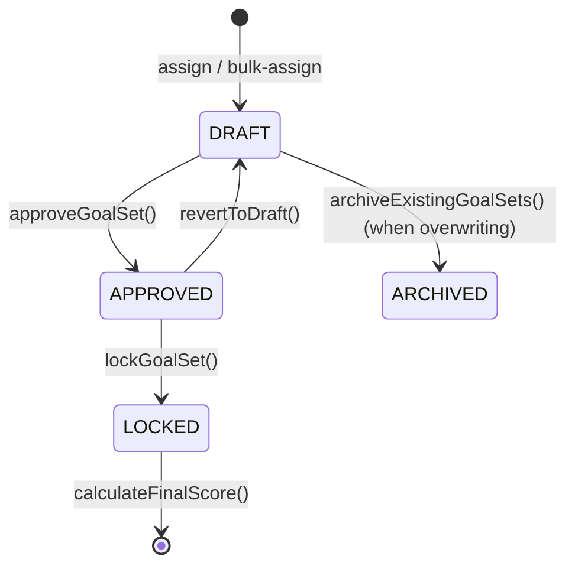
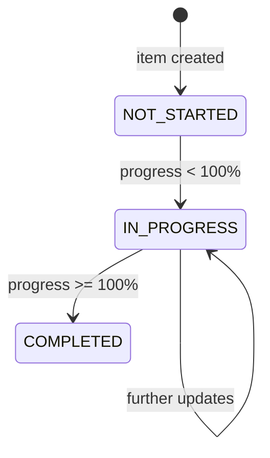

# KPI Module — Complete Flow Analysis

## Overview

The KPI module is a **multi-layered, role-driven performance management system** built with Spring Boot (backend) and React/RTK Query (frontend). It follows a **top-down assignment workflow**: HR/Admin creates library templates → Manager assigns to employees → Employee tracks progress → Manager approves/locks → System finalizes score.

---

## 1. Data Model Hierarchy

```
KpiLibrary  ──(1:N)──▶  KpiLibraryDetails   (template layer)
     │
     └── linked to Position
     
KpiGoals    ──(1:N)──▶  KpiGoalItem          (live goal layer)
     │                       └── KpiProgress  (progress snapshots)
     ├── linked to Employee (owner)
     ├── linked to Employee (manager)
     └── linked to AppraisalCycle

KpiFinalScore ──▶ KpiGoals + Employee + Appraisal  (finalization)

KpiHistoryLog   (full audit trail for every state change)
KpiCategory     (categorizes each goal item)
```

| Entity | Table | Purpose |
|---|---|---|
| `KpiLibrary` | `kpi_library` | Reusable KPI template tied to a Position |
| `KpiLibraryDetails` | (child) | Individual goal lines in a template |
| `KpiGoals` | `kpi_goals` | Employee's live goal-set for a cycle |
| `KpiGoalItem` | `kpi_goal_items` | Concrete goal items with scoring math |
| `KpiProgress` | — | Immutable progress snapshots per update |
| `KpiFinalScore` | `kpi_final_scores` | Locked final weighted score per cycle |
| `KpiHistoryLog` | — | Append-only audit log of all KPI events |
| `KpiCategory` | — | Category classification for goal items |

---

## 2. KpiGoalStatus State Machine



> [!IMPORTANT]
> ARCHIVED and LOCKED are terminal states. A LOCKED goal set cannot be reverted. A finalized score cannot be recalculated.

> **SCORED** is a frontend-derived UI state (not a `KpiGoalStatus` enum). It is true when `KpiFinalScore` exists for the employee + cycle. The stepper in `GoalDetail` shows a 4th "Scored" step to represent this.

---

## 3. KpiItemStatus State Machine



---

## 4. Full End-to-End Workflow

### Phase 1 — Library Setup (HR/Admin only)

```
POST /api/v1/kpi/library
POST /api/v1/kpi/library/import            ← Excel .xlsx upload
PUT  /api/v1/kpi/library/{id}
POST /api/v1/kpi/library/{id}/clone?newTitle=
PATCH /api/v1/kpi/library/{id}/status         ← activate/deactivate
PATCH /api/v1/kpi/library/{id}/toggle-history-status
DELETE /api/v1/kpi/library/{id}
```

**`createLibrary` validation rules:**
- At least 1 detail required
- No duplicate goal titles within the same library
- Each item weight ≤ **35%**
- Total weight must be exactly **100%**

**`importLibraries` (Excel):**
- Only `.xlsx` accepted
- Uses `StyledKpiExcelParser` to parse sheets
- **Soft-replace logic**: if a library with the same title + positionId already exists and is active → deactivate it first, then create a new active one
- Returns `KpiImportResult` with `totalSectionsFound`, `successfulImports`, `failedImports`, and `errors[]`

**`cloneLibrary`:**
- Requires `newTitle` as a query param: `POST /library/{id}/clone?newTitle=...`

**`toggleHistoryStatus`** (exclusive activation):
- When activating a library, automatically **deactivates all other libraries** for the same position → ensures only 1 active library per position at a time

---

### Phase 2 — Goal Assignment (Manager/HR/Admin)

```
POST /api/v1/kpi/assign           ← single employee
POST /api/v1/kpi/bulk-assign      ← multiple employees at once
```

**Single Assignment flow (`assignKpiToEmployee`):**
1. Validate employee exists
2. Validate library is **active** (if provided)
3. Validate appraisal cycle exists
4. Check existing goals for that employee + cycle:
   - If `APPROVED` or `LOCKED` → **hard block**, cannot overwrite
   - If `DRAFT` + `overwriteExisting=true` → archive old, create new
   - If `DRAFT` + `overwriteExisting=false` → throw conflict error
5. Create `KpiGoals` with status `DRAFT`, version `1`
6. Copy `KpiLibraryDetails` → `KpiGoalItem[]` (actualValue=0, scorePercent=0, weightedScore=0, status=NOT_STARTED)
7. Publish `KPI_ASSIGNED` notification to employee
8. Write `KPI_ASSIGNED` to `KpiHistoryLog`
9. Write to Audit log

**Blank assignment** (no `libraryId`): creates an empty `KpiGoals` with no items. Used by "Start Blank Session" in `GoalAssignmentWorkspace`.

**Bulk Assignment:**
- Same logic per employee, but APPROVED/LOCKED → **SKIPPED** (not blocked)
- Each employee result is tracked individually in `BulkAssignmentResponse`

---

### Phase 3 — Goal Item Management (Manager/HR/Admin — DRAFT only)

```
POST   /api/v1/kpi/goal-set/{goalSetId}/items    ← add item
PUT    /api/v1/kpi/items/{itemId}                ← update item
DELETE /api/v1/kpi/items/{itemId}                ← delete item
PUT    /api/v1/kpi/goal-set/{id}/bulk-items      ← bulk update
```

**Rules:**
- Goal set must be in **DRAFT** status
- Item weight cap: ≤ **35%**
- Delete blocked if item has existing `KpiProgress` records → use Revise flow instead

**Frontend Save Draft multi-step flow (GoalAssignmentWorkspace):**
1. Create goal set if none exists (blank assign)
2. Add each `_isNew` (temp) item individually via `addGoalItem`
3. Bulk-update all persisted items via `bulkUpdateGoalItems`

---

### Phase 4 — Goal Approval (Manager/HR/Admin)

```
POST /api/v1/kpi/approve/{id}
```

**`approveGoalSet` flow:**
1. Verify caller is the **creator manager**, **direct reporting-line manager**, or **HR/Admin**
2. Goal set must be in `DRAFT`
3. Sum of **active** item weights must equal **exactly 100%**
4. Set status → `APPROVED`, record `approvedAt` + `approvedBy`
5. Notify employee: `KPI_APPROVED`
6. Log `KPI_APPROVED` to history
7. Write audit log

**Revert to Draft:**
```
POST /api/v1/kpi/goal-set/{id}/revert
```
- Allowed from `APPROVED` (not from `LOCKED` or `ARCHIVED`)
- Sends `KPI_REJECTED` type notification to employee
- Frontend shows a custom confirmation modal listing consequences before calling this endpoint

---

### Phase 5 — KPI Revision (Manager/HR/Admin — DRAFT or APPROVED)

```
PUT /api/v1/kpi/revise/{itemId}
```

**`reviseKpi` flow:**
1. Auth: only creator manager, direct manager, or HR/Admin
2. Allowed on `DRAFT` or `APPROVED` goal sets
3. Detects field-level changes (title, targetValue, weightPercent, category) and builds diff string
4. If no actual changes detected → throw error (no no-op revisions)
5. Updates item **in-place** (progress history stays intact)
6. Bumps `KpiGoals.version` by +1
7. Sends `KPI_REVISED` notification with change reason
8. Logs `ITEM_REVISED` to history with old→new diff

---

### Phase 6 — Progress Tracking (Employee / Manager for compliance items)

```
POST /api/v1/kpi/progress
GET  /api/v1/kpi/progress/history?employeeId=&limit=
```

**`updateProgress` flow:**
1. Goal set must be `APPROVED` (not DRAFT, not LOCKED)
2. Auth:
   - Employee → can update **their own** non-compliance items
   - Manager/HR/Admin → can update **compliance items only** (for verification)
3. Validate `actualValue`:
   - Must be ≥ 0
   - Must be ≤ `targetValue`
4. Save immutable `KpiProgress` snapshot
5. Recalculate on `KpiGoalItem`:
   - `scorePercent = (actualValue / targetValue) × 100`
   - Special case: if `targetValue == 0` → 100% if actual is 0, else 0% (Zero Tolerance)
   - `weightedScore = scorePercent × (weightPercent / 100)`
6. Update item status: `IN_PROGRESS` or `COMPLETED`
7. If item reaches `COMPLETED` → notify manager: `KPI_PROGRESS_UPDATED`
8. Log `PROGRESS_UPDATE` to history with formatted change string

**Request body includes `progressPercent`** alongside `actualValue` and optional `evidenceNote`.

---

### Phase 7 — Lock Goal Set

```
POST /api/v1/kpi/goal-set/{id}/lock
```

- Goal set must be `APPROVED`
- Sets status → `LOCKED`
- Sends `KPI_LOCKED` notification to employee
- Logs `KPI_LOCKED` to history

> [!NOTE]
> After locking, no more progress updates can be made (progress service blocks non-APPROVED sets).

---

### Phase 8 — Final Score Calculation (Manager/HR)

```
POST /api/v1/kpi/calculate-score?employeeId=&cycleId=
GET  /api/v1/kpi/calculate-score?employeeId=&cycleId=   ← fetch existing score
```

**Preconditions checked before scoring:**
1. Goal set must be `APPROVED` or `LOCKED`
2. Employee must be **active**
3. Score must **not** already exist for this employee + cycle (idempotency guard)
4. Total active item weight == **100%**

**Calculation:**
- Sums all `KpiGoalItem.weightedScore` → `totalWeightedScore`
- Saves `KpiFinalScore` with `weightedScore` and `totalAchievementPercent`
- Links to existing `Appraisal` record if one exists for the same employee + cycle
- Notifies employee: `FINAL_RESULT_PUBLISHED`
- Writes audit log

**Frontend:** `GoalDetail` uses `useGetFinalScoreQuery` (GET) to check for an existing score and display the Final Score Card when `isScoredState=true`.

---

### Phase 9 — Midcycle KPI Change and Composite Scoring

```
POST /api/v1/kpi/midcycle/change
POST /api/v1/kpi/midcycle/{employeeId}/{cycleId}/finalize
GET  /api/v1/kpi/midcycle/{employeeId}/{cycleId}
```

**`triggerMidcycleChange` flow:**
1. Manager/HR/Admin requests a midcycle change with `employeeId`, `cycleId`, `changeDate`, and `changeReason`.
2. Cycle must allow midcycle changes and the date must fall between cycle start and one day before cycle end.
3. The current open phase is closed on the change date. If the current phase goal set is `APPROVED`, it is locked first.
4. The closed phase is scored from its goal set and marked `SCORED`.
5. A new open phase is created starting on the change date and waits for KPI assignment.
6. The manager receives a notification to assign KPIs for the new phase.

**`calculateCompositeFinalScore` flow:**
1. HR/Admin finalizes the employee's midcycle composite score for the cycle.
2. The last open phase is bounded by the cycle end date and locked if needed.
3. Phase weights are derived from phase duration relative to total cycle days.
4. Each phase score contribution is summed into a composite final score.
5. A `KpiMidcycleFinalScore` record is stored with phase breakdown and composite score.
6. A cycle-level `KpiFinalScore` is also recreated for the employee + cycle.

**`getMidcycleSummary` behavior:**
- Returns phase-level details, open/ scored phase status, composite score, and whether a new phase is still open.
- Supports employee, manager, HR, and admin access.

**Midcycle notes:**
- Goal sets assigned during an active midcycle are linked into the open phase via `linkGoalSetToOpenPhase`.
- Midcycle scoring extends the standard KPI lifecycle with phase-based score tracking and a composite cycle result.

---

## 5. API Endpoints Summary

### KpiController — `/api/v1/kpi`

| # | Method | Endpoint | Roles | Purpose |
|---|---|---|---|---|
| 1 | GET | `/active-cycle` | All | Get active appraisal cycle |
| 2 | POST | `/library` | HR, ADMIN | Create KPI library |
| 3 | GET | `/library` | All | Get all active libraries |
| 4 | GET | `/library/all` | All | Get all libraries (incl. inactive) |
| 5 | POST | `/library/import` | HR, ADMIN | Import from Excel (.xlsx) |
| 6 | GET | `/library/{id}` | All | Get library by ID |
| 7 | PUT | `/library/{id}` | HR, ADMIN | Update library |
| 8 | DELETE | `/library/{id}` | HR, ADMIN | Delete library |
| 9 | POST | `/library/{id}/clone?newTitle=` | HR, ADMIN | Clone library with new title |
| 10 | GET | `/library/search` | All | Paginated keyword search |
| 11 | GET | `/library/history/{positionId}` | All | Library history by position |
| 12 | PATCH | `/library/{id}/status` | HR, ADMIN | Toggle active/inactive |
| 13 | PATCH | `/library/{id}/toggle-history-status` | HR, ADMIN | Exclusive activation |
| 14 | POST | `/assign` | MGR, HR, ADMIN | Assign KPI to employee |
| 15 | POST | `/bulk-assign` | MGR, HR, ADMIN | Bulk assign KPI |
| 16 | POST | `/goal-set/{id}/items` | MGR, HR, ADMIN | Add goal item |
| 17 | PUT | `/items/{itemId}` | MGR, HR, ADMIN | Update goal item |
| 18 | DELETE | `/items/{itemId}` | MGR, HR, ADMIN | Delete goal item |
| 19 | PUT | `/goal-set/{id}/bulk-items` | MGR, HR, ADMIN | Bulk update items |
| 20 | POST | `/approve/{id}` | MGR, HR, ADMIN | Approve goal set |
| 21 | POST | `/goal-set/{id}/revert` | MGR, HR, ADMIN | Revert to draft |
| 22 | POST | `/goal-set/{id}/lock` | MGR, HR, ADMIN | Lock goal set |
| 23 | POST | `/progress` | All | Update progress |
| 24 | GET | `/progress/history` | All | Get recent progress history |
| 25 | PUT | `/revise/{itemId}` | MGR, HR, ADMIN | Revise a goal item |
| 26 | POST | `/calculate-score` | MGR, HR | Finalize KPI score |
| 27 | GET | `/calculate-score` | MGR, HR | Fetch existing final score |
| 28 | GET | `/goal-set/employee/{id}` | All | Get employee's goal set by cycle |
| 29 | GET | `/goal-set/{id}` | All | Get goal set by ID |
| 30 | GET | `/goal-set/employee/all/{id}` | All | Get all goal sets for an employee |
| 31 | GET | `/goal-set/team` | MANAGER | Get team goal sets |
| 32 | GET | `/goal-set/department` | HR, ADMIN | Get department goal sets |

### KpiMidcycleController — `/api/v1/kpi/midcycle`

| # | Method | Endpoint | Roles | Purpose |
|---|---|---|---|---|
| 33 | POST | `/change` | MANAGER, HR, ADMIN | Trigger a midcycle KPI change |
| 34 | POST | `/{employeeId}/{cycleId}/finalize` | HR, ADMIN | Finalize composite midcycle score |
| 35 | GET | `/{employeeId}/{cycleId}` | EMPLOYEE, MANAGER, HR, ADMIN | Get midcycle summary |

### KpiHistoryController — `/api/v1/kpi-history`

| # | Method | Endpoint | Roles | Purpose |
|---|---|---|---|---|
| 36 | GET | `/employee/{employeeId}` | All | All historical goal sets for an employee |
| 37 | GET | `/goal-set/{goalSetId}/audit` | All | Full audit trail for a goal set |

### KpiCategoryController — `/api/v1/kpi/categories`

| # | Method | Endpoint | Roles | Purpose |
|---|---|---|---|---|
| 38 | POST | `/` | HR, ADMIN | Create KPI category |
| 39 | GET | `/` | All | Get all categories |
| 40 | GET | `/{id}` | All | Get category by ID |
| 41 | PUT | `/{id}` | HR, ADMIN | Update category |
| 42 | DELETE | `/{id}` | ADMIN | Delete category |

---

## 6. Frontend Pages (React)

| Page | Route | Role | Purpose |
|---|---|---|---|
| `KpiHub` | `/kpi` | All | Dashboard landing — progress overview, quick navigation |
| `KpiLibraryDashboard` | `/kpi/library` | HR/Admin | Manage library list, activate/deactivate, history |
| `KpiLibraryEntry` | `/kpi/library/new` or `/kpi/library/edit/:id` | HR/Admin | Create or edit KPI library template |
| `GoalManagement` | `/kpi/manage` | MGR/HR/Admin | Paginated employee list, goal status, bulk assign, historical cycle support |
| `GoalAssignmentWorkspace` | `/kpi/assign/:employeeId` | MGR/HR/Admin | Assign/edit goal items with inline table; historical cycle read-only mode |
| `GoalDetail` | `/kpi/goals/:employeeId` | MGR/HR/Admin (+ owner) | View and manage a goal set; approve/revert/lock/score; item update & revision |
| `MyKpiDashboard` | `/kpi/my` | Employee | Employee's personal KPI tracking |
| `TeamKpiDashboard` | `/kpi/team` | Manager / HR / Admin | Team goal tracking — direct reports or all employees |
| `EmployeeKpiHistory` | `/kpi/history/:employeeId` | All | Historical cycles with metrics and audit trail |
| `KpiCategoryManager` | `/admin/kpi/categories` | Admin | CRUD management of KPI categories |

---

## 7. Frontend Utility Modules

| File | Exports | Used By |
|---|---|---|
| `kpiStatusStyles.ts` | `KPI_STATUS_STYLE`, `KPI_STATUS_FALLBACK` | `GoalManagement`, `GoalAssignmentWorkspace`, `KpiCategoryManager` |
| `kpiTransformationService.ts` | `calculateGoalSetMetrics`, `enrichGoalSet`, `enrichGoalSets` | `EmployeeKpiHistory` |
| `kpiCalculations.ts` | `calculateProgressPercent`, `calculateWeightedScore`, `validateKpiWeights`, `PRIORITY_MAP`, `getPriorityFromWeight`, `getStatusColor` | General KPI math helpers |

**`KPI_STATUS_STYLE` labels:**
- `DRAFT` → "Drafting" (light blue)
- `APPROVED` → "Approved" (light green)
- `LOCKED` → "Locked (Active)" (warm neutral gray)
- `SCORED` → "Score Calculated" (light green)
- `ARCHIVED` → "Archived" (cool gray)

**`validateKpiWeights` enforces:**
- Total weight = 100%
- Each item weight ≥ 5% and ≤ 35%

---

## 8. RTK Query Hooks Reference

| Hook | Method | Endpoint |
|---|---|---|
| `useGetActiveCycleQuery` | GET | `/kpi/active-cycle` |
| `useGetKpiCategoriesQuery` | GET | `/kpi/categories` |
| `useCreateKpiCategoryMutation` | POST | `/kpi/categories` |
| `useUpdateKpiCategoryMutation` | PUT | `/kpi/categories/{id}` |
| `useDeleteKpiCategoryMutation` | DELETE | `/kpi/categories/{id}` |
| `useCreateLibraryMutation` | POST | `/kpi/library` |
| `useImportLibrariesMutation` | POST | `/kpi/library/import` |
| `useGetAllLibrariesQuery` | GET | `/kpi/library` |
| `useGetAllLibrariesWithInactiveQuery` | GET | `/kpi/library/all` |
| `useToggleLibraryStatusMutation` | PATCH | `/kpi/library/{id}/status` |
| `useToggleHistoryStatusMutation` | PATCH | `/kpi/library/{id}/toggle-history-status` |
| `useDeleteLibraryMutation` | DELETE | `/kpi/library/{id}` |
| `useGetLibraryByIdQuery` | GET | `/kpi/library/{id}` |
| `useUpdateLibraryMutation` | PUT | `/kpi/library/{id}` |
| `useGetLibraryHistoryQuery` | GET | `/kpi/library/history/{positionId}` |
| `useAssignKpiToEmployeeMutation` | POST | `/kpi/assign` |
| `useBulkAssignKpiMutation` | POST | `/kpi/bulk-assign` |
| `useAddGoalItemMutation` | POST | `/kpi/goal-set/{id}/items` |
| `useUpdateGoalItemMutation` | PUT | `/kpi/items/{itemId}` |
| `useDeleteGoalItemMutation` | DELETE | `/kpi/items/{itemId}` |
| `useBulkUpdateGoalItemsMutation` | PUT | `/kpi/goal-set/{id}/bulk-items` |
| `useApproveGoalSetMutation` | POST | `/kpi/approve/{id}` |
| `useRevertGoalSetMutation` | POST | `/kpi/goal-set/{id}/revert` |
| `useLockGoalSetMutation` | POST | `/kpi/goal-set/{id}/lock` |
| `useUpdateProgressMutation` | POST | `/kpi/progress` |
| `useGetProgressHistoryQuery` | GET | `/kpi/progress/history` |
| `useReviseKpiMutation` | PUT | `/kpi/revise/{itemId}` |
| `useCalculateScoresMutation` | POST | `/kpi/calculate-score` |
| `useGetFinalScoreQuery` | GET | `/kpi/calculate-score` |
| `useGetGoalSetByEmployeeQuery` | GET | `/kpi/goal-set/employee/{id}?cycleId=` |
| `useGetGoalSetByIdQuery` | GET | `/kpi/goal-set/{id}` |
| `useGetTeamGoalSetsQuery` | GET | `/kpi/goal-set/team` |
| `useGetDepartmentGoalSetsQuery` | GET | `/kpi/goal-set/department` |
| `useGetEmployeeKpiHistoryQuery` | GET | `/kpi-history/employee/{id}` |
| `useGetGoalSetAuditTrailQuery` | GET | `/kpi-history/goal-set/{id}/audit` |

---

## 9. Key Business Rules Summary

| Rule | Enforced In |
|---|---|
| Library total weight = 100% | `KpiLibraryServiceImpl.validateLibraryWeights()` |
| Library item weight ≤ 35% | `KpiLibraryServiceImpl` + `KpiGoalServiceImpl` |
| No duplicate goal titles in library | `validateLibraryWeights()` |
| Only 1 active library per position | `toggleHistoryStatus()` exclusive deactivation |
| Can't assign from inactive library | `assignKpiToEmployee()` + `bulkAssignKpi()` |
| Can't overwrite APPROVED/LOCKED goals | Both assign methods |
| Only DRAFT goals can have items added/updated/deleted | `addGoalItem`, `updateGoalItem`, `deleteGoalItem` |
| Can't delete item with existing progress | `deleteGoalItem()` |
| Approval requires total weight = 100% | `approveGoalSet()` |
| Only APPROVED goals can receive progress updates | `updateProgress()` |
| Progress actual value ∈ [0, targetValue] | `updateProgress()` |
| Only manager or HR/Admin can update compliance items | `updateProgress()` |
| Revisions require at least one actual field change | `reviseKpi()` |
| Score calculation is idempotent (once per cycle) | `calculateFinalScore()` |
| Score requires APPROVED or LOCKED goal set | `calculateFinalScore()` |
| Clone requires a `newTitle` query param | `cloneLibrary()` |
| Frontend: each item weight ≥ 5% (UI validation only) | `validateKpiWeights()` in `kpiCalculations.ts` |

---

## 10. Notification Events

| Trigger | Type | Recipient |
|---|---|---|
| Goal assigned | `KPI_ASSIGNED` | Employee |
| Goal approved | `KPI_APPROVED` | Employee |
| Goal reverted to draft | `KPI_REJECTED` | Employee |
| Goal locked | `KPI_LOCKED` | Employee |
| Goal item revised | `KPI_REVISED` | Employee |
| Goal item completed (100%) | `KPI_PROGRESS_UPDATED` | Manager |
| Final score published | `FINAL_RESULT_PUBLISHED` | Employee |

---

## 11. Services Architecture

```
KpiController  (/api/v1/kpi)
    ├── KpiLibraryService  → KpiLibraryServiceImpl
    │       ├── KpiLibraryRepository
    │       ├── KpiLibraryDetailsRepository
    │       ├── PositionRepository
    │       ├── KpiCategoryRepository
    │       ├── KpiMapper
    │       └── StyledKpiExcelParser (Excel importer)
    │
    ├── KpiGoalService     → KpiGoalServiceImpl
    │       ├── KpiGoalsRepository
    │       ├── KpiGoalItemRepository
    │       ├── KpiLibraryRepository
    │       ├── AppraisalCycleRepository
    │       ├── EmployeeRepository
    │       ├── KpiCategoryRepository
    │       ├── KpiProgressRepository
    │       ├── KpiHistoryLogRepository
    │       ├── ReportingLineRepository
    │       ├── ApplicationEventPublisher (notifications)
    │       └── AuditService
    │
    ├── KpiProgressService → KpiProgressServiceImpl
    │       ├── KpiGoalItemRepository
    │       ├── KpiProgressRepository
    │       ├── KpiHistoryLogRepository
    │       └── ApplicationEventPublisher
    │
    └── KpiScoringService  → KpiScoringServiceImpl
            ├── KpiGoalsRepository
            ├── KpiGoalItemRepository
            ├── KpiFinalScoreRepository
            ├── AppraisalRepository (links score to Appraisal)
            ├── AuditService
            └── ApplicationEventPublisher

KpiMidcycleService  → KpiMidcycleServiceImpl
            ├── KpiGoalsRepository
            ├── KpiGoalPhaseRepository
            ├── KpiMidcycleFinalScoreRepository
            ├── KpiFinalScoreRepository
            ├── AppraisalRepository
            ├── KpiHistoryLogRepository
            ├── EmployeeRepository
            ├── AppraisalCycleRepository
            ├── AuditService
            └── ApplicationEventPublisher

KpiHistoryController  (/api/v1/kpi-history)
    └── KpiHistoryService  → KpiHistoryServiceImpl
            ├── KpiGoalsRepository
            ├── KpiGoalItemRepository
            └── KpiHistoryLogRepository

KpiCategoryController  (/api/v1/kpi/categories)
    └── KpiCategoryService  → KpiCategoryServiceImpl
            └── KpiCategoryRepository
```

---

## 12. TypeScript Types Reference (`kpiTypes.ts`)

| Type / Interface | Key Fields |
|---|---|
| `KpiGoalStatus` | `'DRAFT' \| 'APPROVED' \| 'LOCKED' \| 'ARCHIVED'` |
| `KpiItemStatus` | `'NOT_STARTED' \| 'IN_PROGRESS' \| 'COMPLETED'` |
| `Priority` | `'CRITICAL' \| 'HIGH' \| 'MEDIUM' \| 'LOW'` |
| `KpiCategory` | `id`, `name?`, `categoryName?` |
| `KpiLibraryRequest` | `title`, `description?`, `positionId`, `targetLevelId?`, `details[]` |
| `KpiLibraryResponse` | `id`, `title`, `positionName`, `isActive`, `details[]`, `levelName?` |
| `GoalAssignmentRequest` | `employeeId`, `libraryId?`, `appraisalCycleId`, `overwriteExisting?` |
| `BulkGoalAssignmentRequest` | `employeeIds[]`, `libraryId`, `appraisalCycleId`, `overwriteExisting?` |
| `GoalItemResponse` | `id`, `title`, `targetValue`, `weightPercent`, `status`, `currentProgress?`, `scorePercent?`, `weightedScore?`, `isCompliance?`, `verifiedAt?`, `verifiedBy?` |
| `GoalSetResponse` | `id`, `employeeId`, `managerId`, `managerName`, `assignedBy?`, `assignedByName?`, `assignedAt?`, `status`, `version?`, `items[]`, `score?`, `kpiItems?` |
| `ProgressRequest` | `goalItemId`, `actualValue`, `progressPercent`, `evidenceNote?` |
| `KpiProgressHistory` | `id`, `goalItemId`, `goalTitle`, `actualValue`, `progressPercent`, `evidenceNote?`, `updatedAt` |
| `KpiRevisionRequest` | `changeReason`, `updatedDetails: KpiLibraryDetailRequest` |
| `KpiScoreResponse` | `id`, `employeeId`, `cycleId`, `weightedScore`, `totalAchievementPercent?`, `calculatedAt` |
| `KpiHistoryLog` | `id`, `employeeId`, `action`, `changeReason`, `changeDetails?`, `changedBy`, `createdAt` |
| `KpiImportResult` | `totalSectionsFound`, `successfulImports`, `failedImports`, `errors[]` |
| `BulkAssignmentResponse` | `totalProcessed`, `successfulCount`, `failedCount`, `skippedCount`, `results[]` |
